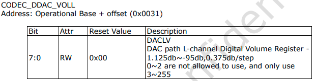

# Audio DeviceTree

## rk1808.dtsi

```c
/ {
	i2s1: i2s@ff7f0000 {
		compatible = "rockchip,rk1808-i2s", "rockchip,rk3066-i2s";
		reg = <0x0 0xff7f0000 0x0 0x1000>;
		interrupts = <GIC_SPI 11 IRQ_TYPE_LEVEL_HIGH>;
		clocks = <&cru SCLK_I2S1_2CH>, <&cru HCLK_I2S1_2CH>;
		clock-names = "i2s_clk", "i2s_hclk";
		dmas = <&dmac 18>, <&dmac 19>;
		dma-names = "tx", "rx";
		resets = <&cru SRST_I2S1>, <&cru SRST_I2S1_H>;
		reset-names = "reset-m", "reset-h";
		pinctrl-names = "default";
		pinctrl-0 = <&i2s1_2ch_sclk
			     &i2s1_2ch_lrck
			     &i2s1_2ch_sdi
			     &i2s1_2ch_sdo>;
		status = "disabled";
	};
    
    pinctrl: pinctrl {  
		i2s1 {
			i2s1_2ch_lrck: i2s1-2ch-lrck {
				rockchip,pins =
					<3 RK_PA0 1 &pcfg_pull_none_2ma>;
			};
			i2s1_2ch_sclk: i2s1-2ch-sclk {
				rockchip,pins =
					<3 RK_PA1 1 &pcfg_pull_none_2ma>;
			};
			i2s1_2ch_mclk: i2s1-2ch-mclk {
				rockchip,pins =
					<3 RK_PA2 1 &pcfg_pull_none_2ma>;
			};
			i2s1_2ch_sdo: i2s1-2ch-sdo {
				rockchip,pins =
					<3 RK_PA3 1 &pcfg_pull_none_2ma>;
			};
			i2s1_2ch_sdi: i2s1-2ch-sdi {
				rockchip,pins =
					<3 RK_PA4 1 &pcfg_pull_none_2ma>;
			};
		};
    };
}
```

## rk1808-evb.dtsi

```c
/ {
	rk809_sound: rk809-sound {
		status = "disabled";
		compatible = "simple-audio-card";
		simple-audio-card,format = "i2s";
		simple-audio-card,name = "rockchip,rk809-codec";
		simple-audio-card,mclk-fs = <256>;
		simple-audio-card,widgets =
			"Microphone", "Mic Jack",
			"Headphone", "Headphone Jack";
		simple-audio-card,routing =
			"Mic Jack", "MICBIAS1",
			"IN1P", "Mic Jack",
			"Headphone Jack", "HPOL",
			"Headphone Jack", "HPOR";
		simple-audio-card,cpu {
			sound-dai = <&i2s1>;
		};
		simple-audio-card,codec {
			sound-dai = <&rk809_codec>;
		};
	};
}
```

```c
&i2c0 {
	rk809: pmic@20 {
		rk809_codec: codec {
			#sound-dai-cells = <0>;
			compatible = "rockchip,rk809-codec", "rockchip,rk817-codec";
			clocks = <&cru SCLK_I2S1_2CH_OUT>;
			clock-names = "mclk";
			pinctrl-names = "default";
			pinctrl-0 = <&i2s1_2ch_mclk>;
			hp-volume = <20>;
			spk-volume = <3>;
			status = "okay";
		};
	};
};
```

### 볼륨 제어

#### 스피커

`spk-volume` value 수정. 3~255 범위의 값을 사용하며, -1.125db ~ -95db 범위를 0.375db 단위 제어.



## infoworks-rk1808-aikit-rex-pro.dts

```
&rk809_sound {
	status = "okay";
};

&rk809_codec {
	status = "okay";
};

&i2s1 {
	status = "okay";
	#sound-dai-cells = <0>;
};
```

