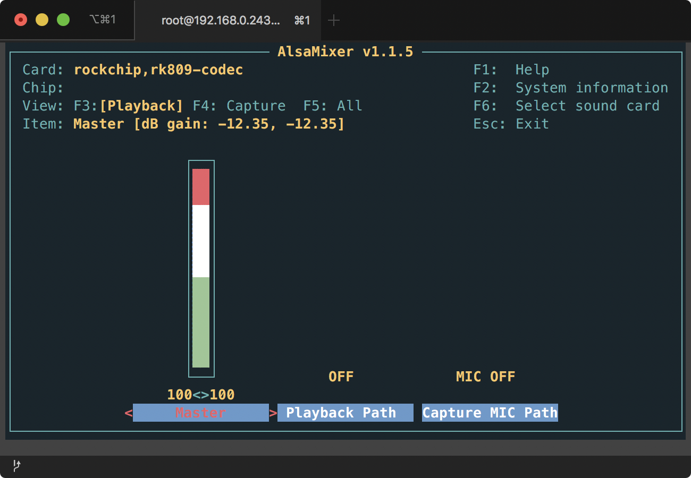
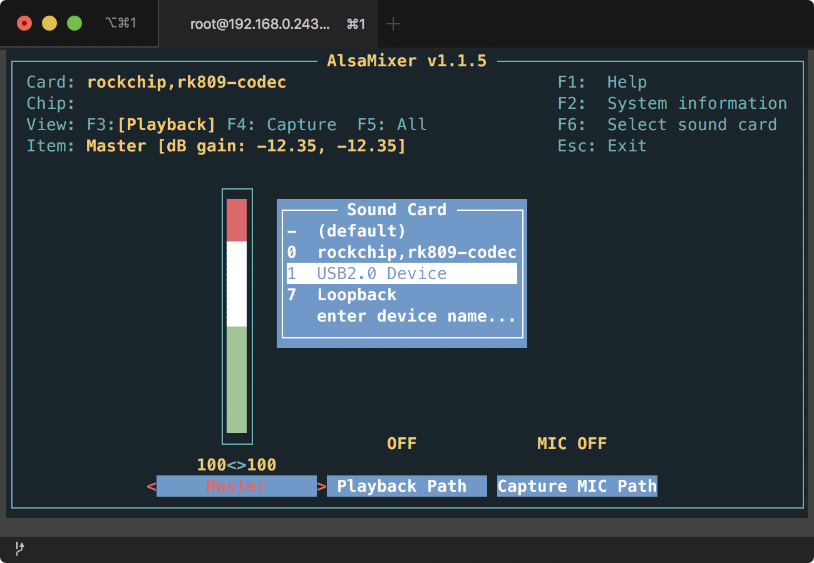
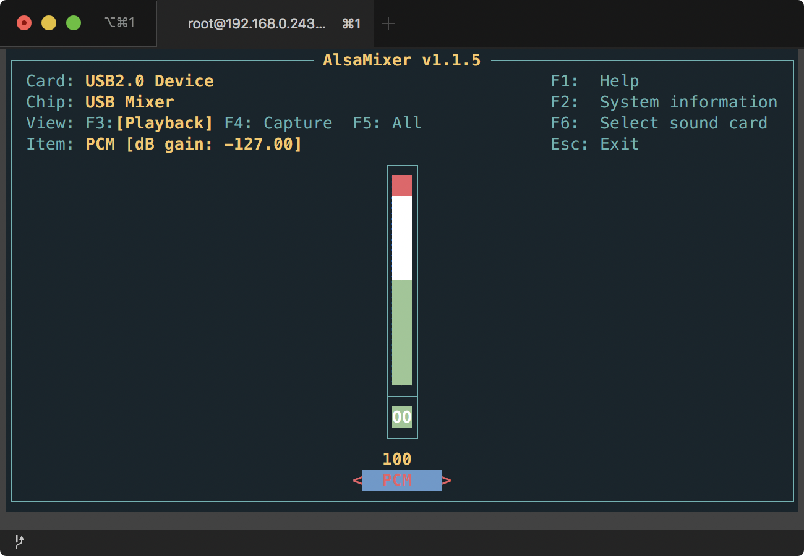
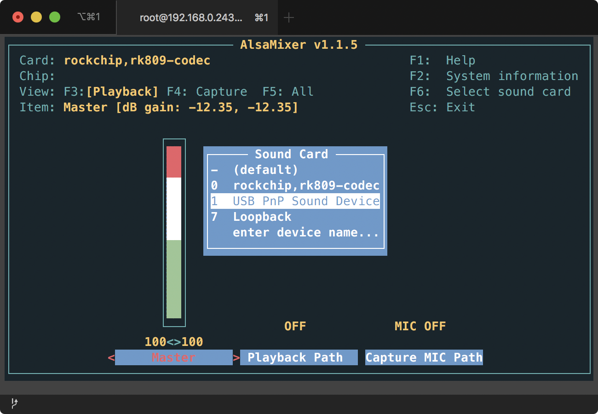
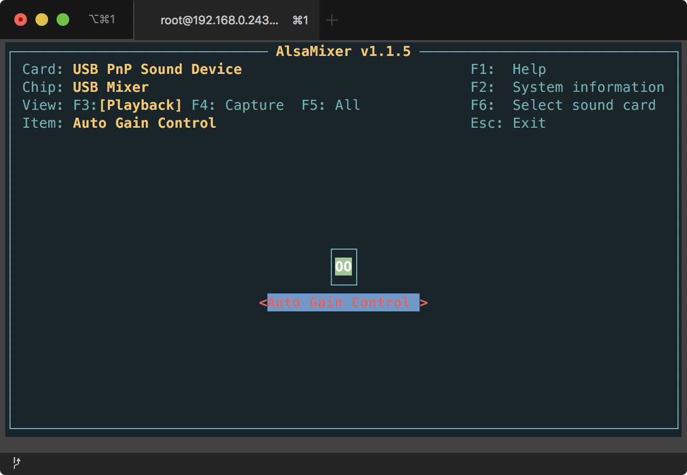
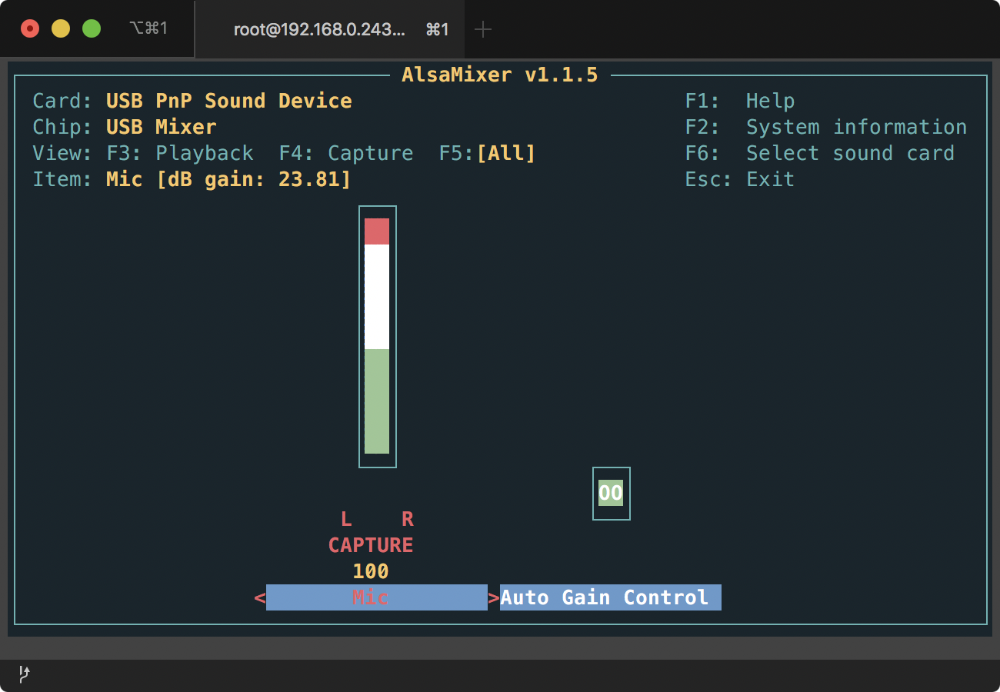

# Rex USB 사운드 입출력

## 명령어

### Device 찾기
`aplay -L` 혹은 `arecord -L` 명령어로 사운드 입출력 디바이스를 찾을 수 있습니다.

USB 사운드 입출력을 위해서는 `USB Audio`라는 설명이 붙은 디바이스 중 `sysdefault:CARD=...` 형식을 가진 것을 이용합니다. 아래 예제의 경우에는 `sysdefault:CARD=Device` 가 적합한 USB 출력 장치입니다.

```sh
[root@Infoworks-REX-basic:~]# aplay -L
null
    Discard all samples (playback) or generate zero samples (capture)
default:CARD=rockchiprk809co
    rockchip,rk809-codec, 
    Default Audio Device
sysdefault:CARD=rockchiprk809co
    rockchip,rk809-codec, 
    Default Audio Device
default:CARD=Device
    USB2.0 Device, USB Audio
    Default Audio Device
sysdefault:CARD=Device
    USB2.0 Device, USB Audio
    Default Audio Device
front:CARD=Device,DEV=0
    USB2.0 Device, USB Audio
    Front speakers
surround21:CARD=Device,DEV=0
    USB2.0 Device, USB Audio
    2.1 Surround output to Front and Subwoofer speakers
surround40:CARD=Device,DEV=0
    USB2.0 Device, USB Audio
    4.0 Surround output to Front and Rear speakers
surround41:CARD=Device,DEV=0
    USB2.0 Device, USB Audio
    4.1 Surround output to Front, Rear and Subwoofer speakers
surround50:CARD=Device,DEV=0
    USB2.0 Device, USB Audio
    5.0 Surround output to Front, Center and Rear speakers
surround51:CARD=Device,DEV=0
    USB2.0 Device, USB Audio
    5.1 Surround output to Front, Center, Rear and Subwoofer speakers
surround71:CARD=Device,DEV=0
    USB2.0 Device, USB Audio
    7.1 Surround output to Front, Center, Side, Rear and Woofer speakers
iec958:CARD=Device,DEV=0
    USB2.0 Device, USB Audio
    IEC958 (S/PDIF) Digital Audio Output
default:CARD=Loopback
    Loopback, Loopback PCM
    Default Audio Device
sysdefault:CARD=Loopback
    Loopback, Loopback PCM
    Default Audio Device
front:CARD=Loopback,DEV=0
    Loopback, Loopback PCM
    Front speakers
surround21:CARD=Loopback,DEV=0
    Loopback, Loopback PCM
    2.1 Surround output to Front and Subwoofer speakers
surround40:CARD=Loopback,DEV=0
    Loopback, Loopback PCM
    4.0 Surround output to Front and Rear speakers
surround41:CARD=Loopback,DEV=0
    Loopback, Loopback PCM
    4.1 Surround output to Front, Rear and Subwoofer speakers
surround50:CARD=Loopback,DEV=0
    Loopback, Loopback PCM
    5.0 Surround output to Front, Center and Rear speakers
surround51:CARD=Loopback,DEV=0
    Loopback, Loopback PCM
    5.1 Surround output to Front, Center, Rear and Subwoofer speakers
surround71:CARD=Loopback,DEV=0
    Loopback, Loopback PCM
    7.1 Surround output to Front, Center, Side, Rear and Woofer speakers
```


### 녹음

`arecord`를 이용해 음성을 녹음하고 파일로 저장할 수 있습니다. USB 마이크가 기본 사운드 입력 장치가 아닐 수 있으므로 `-D` 옵션을 이용해 **디바이스 찾기** 단계에서 찾은 디바이스를 사용합니다.

아래 예제는 *48000Hz*의 Sampling rate, *Signed 16bit (Little Endian)* 포맷으로 5초간 음성을 녹음해 `rec.wav`로 저장합니다.

```shell
arecord -Dsysdefault:CARD=Device -r48000 -fS16_LE -d5 rec.wav
```
* `-D`: 디바이스를 지정합니다.
* `-r`: Sample rate를 설정합니다.
* `-f`: Format을 설정합니다.
* `-d`: 녹음 시간을 설정합니다.

[arecord Linux man page](https://linux.die.net/man/1/arecord)


### 재생

`aplay`를 이용해 파일을 재생합니다. USB 마이크가 기본 사운드 출력 장치가 아닐 수 있으므로 `-D` 옵션을 이용해 **디바이스 찾기** 단계에서 찾은 디바이스를 사용합니다.

아래 예제는 `rec.wav`를 *48000Hz*의 Sampling rate, *Signed 16bit (Little Endian)* 포맷으로 재생합니다.

```shell
aplay -Dsysdefault:CARD=Device -r48000 -fS16_LE rec.wav
```
* `-D`: 디바이스를 지정합니다.
* `-r`: Sample rate를 설정합니다.
* `-f`: Format을 설정합니다.

[aplay Linux man page](https://linux.die.net/man/1/aplay)


### 볼륨 제어(alsamixer)

`alsamixer`를 통해 볼륨을 제어합니다. `F1`~`F12` Function Key를 이용해야 하므로 ssh 접속을 권장합니다.

```shell
[root@Infoworks-REX-basic:/]# alsamixer
```



`alsamixer`를 처음 실행하면 위와 같은 화면이 표시됩니다. `F6`를 눌러 사운드 카드를 선택 메뉴를 엽니다.

#### 스피커



`USB2.0 Device`를 선택합니다. 스피커 모델에 따라 이름이 다를 수 있습니다.




`PCM` 컨트롤을 제어합니다. 상/하 방향키로 원하는 Gain을 세팅하고, `ESC`키를 눌러 종료합니다.

#### 마이크



사운드 카드 선택 메뉴에서 `USP PnP Sound Device`를 선택합니다. 마이크 모델에 따라 이름이 다를 수 있습니다.




`F5`를 눌러 제어 가능한 모든 컨트롤을 엽니다.




좌/우 방향키로 `Mic` 컨트롤을 선택해 상/하 방향키로 원하는 Gain을 설정하고 `ESC` 키로 종료합니다.


### 볼륨 제어(amixer)

#### 사운드 카드 목록 확인

`/proc/asound/cards`의 내용을 확인합니다.

```shell
[root@Infoworks-REX-basic:/]# cat /proc/asound/cards 
 0 [rockchiprk809co]: rockchip_rk809- - rockchip,rk809-codec
                      rockchip,rk809-codec
 1 [Device         ]: USB-Audio - USB2.0 Device
                      Generic USB2.0 Device at usb-ffd90000.usb-1, full speed
```

위 예제에서는 1번이 USB Audio Device인 것을 확인할 수 있습니다.

#### Control 목록 확인

`amixer`를 이용해 control 목록을 확인합니다. `-c` 옵션으로 USB Audio 장치를 지정해야 합니다. **사운드 카드 목록 확인** 단계에서 찾은 장치 번호를 사용합니다.

```shell
[root@Infoworks-REX-basic:/]# amixer -c 1 scontrols
Simple mixer control 'PCM',0
```

제어 가능한 컨트롤은 `PCM`이 있습니다.


#### Control 제어

`-c` 옵션으로 장치를 지정하고, `set PCM n%`로 `PCM` 컨트롤을 n%로 설정합니다. 아래 예제는 볼륨을 100%로 설정합니다.

```shell
[root@Infoworks-REX-basic:/]# amixer -c 1 set PCM 100%
Simple mixer control 'PCM',0
  Capabilities: pvolume pvolume-joined pswitch pswitch-joined
  Playback channels: Mono
  Limits: Playback 0 - 255
  Mono: Playback 255 [100%] [-127.00dB] [on]
```